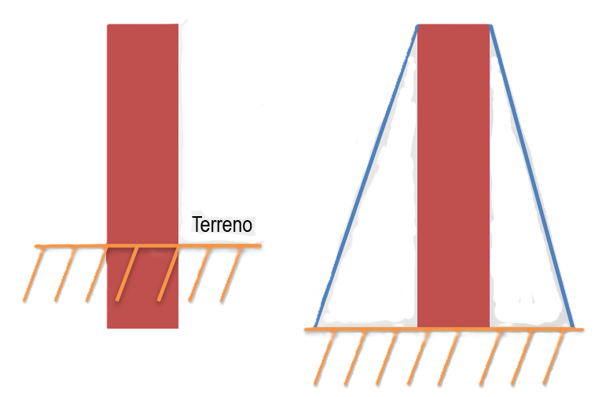

# **10. LA ESTABILIDAD EN LAS ESTRUCTURAS**

La **estabilidad** es una de las tres condiciones esenciales que debe cumplir cualquier estructura (junto con la resistencia y la rigidez) para funcionar correctamente. Sin estabilidad, una estructura podría volcarse, caerse o desplazarse, incluso si sus materiales fueran muy resistentes.

## ¿Qué es la estabilidad?

!!!note "Estabilidad"
    La estabilidad se refiere a la capacidad de una estructura de **no volcarse (caerse) ni desplazarse** frente a las fuerzas que actúan sobre ella (peso propio, viento, personas, impactos, etc.).

## ¿Cómo se puede mejorar la estabilidad?

La manera más eficaz de garantizar la estabilidad de una estructura es seleccionar apropiadamente su **base**.

### 1. **Aumentar el tamaño de la base**

{align=right width=20%}

- Una **base más grande** hace que el centro de gravedad esté más bajo y que la estructura sea menos propensa a volcarse.
- Ejemplo: Una botella ancha es mucho más difícil de volcar que una muy estrecha. Las torres, pirámides y presas suelen tener bases muy amplias.

### 2. **Aumentar el peso de la base**

{align=right width=15%}

- Si la parte inferior de la estructura es más **pesada**, el centro de gravedad se acerca aún más al suelo.
- Esto da lugar a construcciones con contrapesos o cimientos muy pesados. Por ejemplo, un puente puede tener una base reforzada con grandes bloques de hormigón.

### 3. **Sistemas de anclaje, empotramientos y tirantes**

{align=right width=40%}

- **Empotramientos**: Anclar la base de la estructura en el terreno (por ejemplo, columnas profundamente insertadas en el suelo).
- **Tirantes**: Utilizar cables o barras que sujetan y estabilizan partes de la estructura, muy común en puentes colgantes y cubiertas ligeras.[^1]
- Los sistemas de anclaje evitan que la estructura se mueva o desplace por acción del viento, terremotos o impactos.

### **Resumen clave**

> **La estabilidad de una estructura depende de que su centro de gravedad esté lo más bajo posible y bien dentro de la base. Una base amplia, pesada y bien anclada protege contra vuelcos y desplazamientos, asegurando que la estructura resista correctamente las fuerzas externas.**

### **¿Por qué es importante?**

- Evita accidentes y daños materiales.
- Permite construir edificios altos, puentes largos y estructuras seguras en zonas de vientos fuertes o terremotos.
- Es parte fundamental del diseño en arquitectura e ingeniería.

⁂
