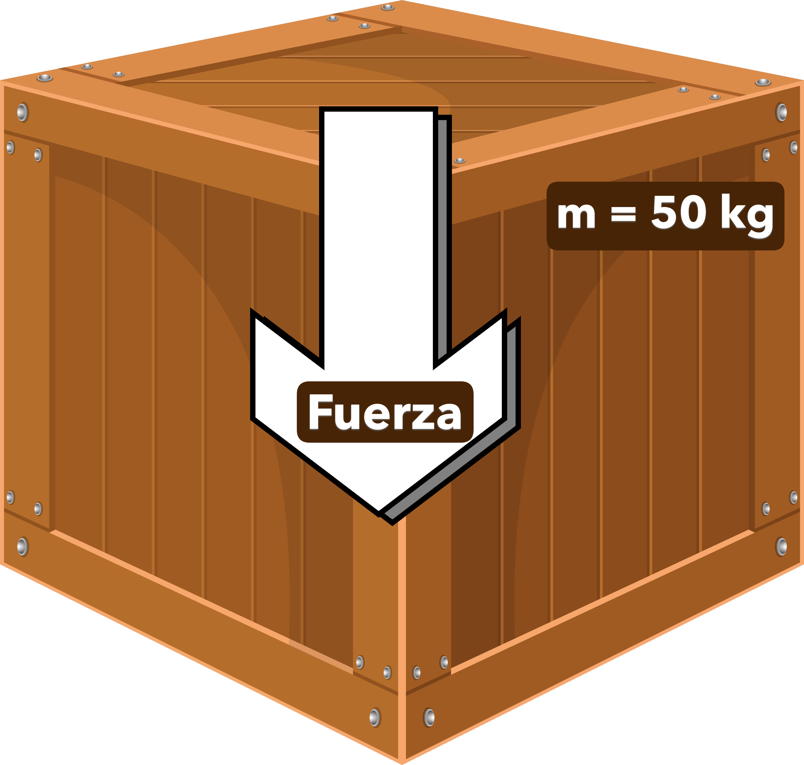
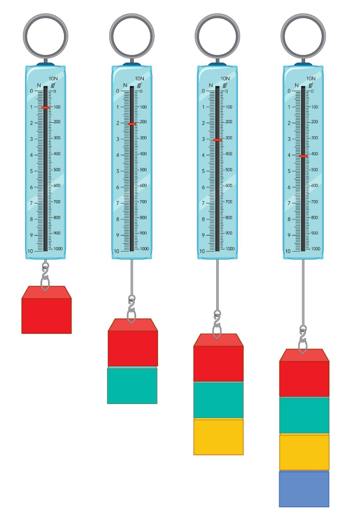

# La medición de las fuerzas

## La unidad: el Newton

Las fuerzas se miden en **newtons** (símbolo: $N$), en honor a **Isaac Newton**, el gran físico inglés que formuló las leyes del movimiento.

**Definición del Newton**:

{align=right width=30%}

Imagina que apoyas en el suelo una caja cuya masa es de 50 kg ($m = 50\ \mathrm{kg}$). Esta caja ejercerá una Fuerza ($F$) sobre el suelo que dependerá de su **masa** y de la aceleración de la **gravedad** ($g=9{,}81\ \mathrm{m/s^2},\ \text{que podemos redondear a}\ 10\ \mathrm{m/s^2}$)

$$
F = \text{Peso} = m \cdot g = 50\ \mathrm{kg} \cdot 10\ \mathrm{m/s^2} = \mathbf{500\ \mathrm{N}}
$$

> En definitiva, una caja de $50\ \mathrm{kg}$ de masa, ejercerá una fuerza (peso) hacia el suelo de unos $500\ \mathrm{N}$.

### Ejemplos de fuerzas en newtons

Para que te hagas una idea de lo que representa un newton:

- **Una manzana de 200g (0,2 kg)**: ejerce aproximadamente **2 newtons** de fuerza en la Tierra
- **Una persona de 62kg**: ejerce aproximadamente **620 newtons** (su peso)
- **Un coche pequeño**: puede pesar alrededor de **10,000 newtons**

## El dinamómetro: midiendo fuerzas

{align=right width=30%}

El **dinamómetro** es un instrumento que nos permite medir fuerzas de manera directa. Funciona mediante un resorte calibrado que se estira proporcionalmente a la fuerza aplicada.

## Efectos de las fuerzas sobre las estructuras

Cuando una estructura soporta fuerzas, pueden ocurrir dos cosas:

### **✅ Resiste adecuadamente** (estructura correcta)

- Mantiene su forma y estabilidad
- Las deformaciones están dentro de límites aceptables
- Cumple su función sin problemas

### **❌ No resiste bien** (estructura inadecuada)

- Se deforma excesivamente
- Puede llegar a romperse
- No cumple con su propósito

Es fundamental que las estructuras estén preparadas para **resistir todas las cargas previstas** y, si es posible, algunas imprevistas, como terremotos o tormentas fuertes.

### Datos impresionantes

**🌪️ ¿Sabías que...?**

- Un huracán puede generar fuerzas equivalentes a **200 bombas nucleares** por día
- La Torre Eiffel se mueve hasta **7 centímetros** en días de mucho viento
- Los rascacielos están diseñados para oscilar varios metros sin colapsar
- Un terremoto de magnitud 9 libera la energía equivalente a **56,000 bombas atómicas**

## Actividades de reflexión

### 🤔 **Piensa y responde:**

1. **Identifica fuerzas**: Enumera 10 fuerzas diferentes que actúen sobre ti mientras estás sentado leyendo esto.
2. **Análisis estructural**: Observa un puente cercano. ¿Qué cargas fijas y variables crees que debe soportar?
3. **Diseño personal**: Si tuvieras que diseñar una estructura para resistir vientos de 100 km/h, ¿qué características le darías?
4. **Experimentación**: ¿Cómo podrías demostrar la tercera ley de Newton usando solo objetos de tu casa?

### 🔬 **Experimento en casa:**

**Prueba de fuerzas**:

1. Toma diferentes objetos (libros, frutas, etc.)
2. Siente su peso (fuerza gravitacional)
3. Empújalos sobre diferentes superficies
4. Observa cómo la **fuerza de fricción** cambia según la superficie

## Preparándote para lo que viene

En este apartado has aprendido qué son las fuerzas y las cargas, cómo se miden y cómo afectan a nuestro entorno. En los siguientes temas profundizaremos en:

- Cómo las fuerzas generan diferentes **esfuerzos** en los elementos estructurales
- Los cinco tipos básicos de esfuerzos que deben soportar las estructuras
- Cómo diseñar elementos para resistir cada tipo de esfuerzo
- La relación entre **material, forma y resistencia**

## Conceptos clave para recordar

**📝 Glosario del tema:**

- **Fuerza**: Agente capaz de deformar un objeto o modificar su estado de movimiento
- **Carga**: Fuerza que actúa específicamente sobre una estructura artificial
- **Carga fija**: No varía con el tiempo (ej.: peso propio de una pared)
- **Carga variable**: Cambia con el tiempo o el uso (ej.: personas, nieve, viento)
- **Newton (N)**: Unidad de medida de la fuerza en el Sistema Internacional
- **Dinamómetro**: Instrumento para medir fuerzas mediante un resorte calibrado
- **Deformación**: Cambio de forma que experimenta un objeto por la acción de una fuerza
- **Inercia**: Tendencia de los objetos a mantener su estado de reposo o movimiento

*¡Excelente trabajo! Has descubierto el fascinante mundo de las fuerzas y cargas. Ahora comprendes por qué las cosas se mueven, se deforman o permanecen en equilibrio. En el próximo apartado aprenderás cómo estas fuerzas se convierten en diferentes tipos de esfuerzos dentro de las estructuras, y cómo los ingenieros diseñan elementos para resistirlos.*

⁂
