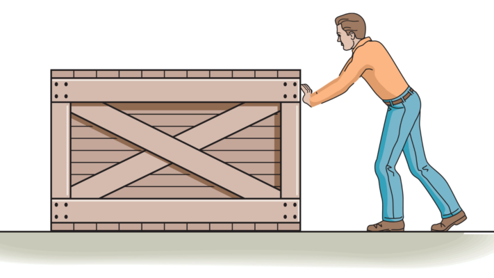
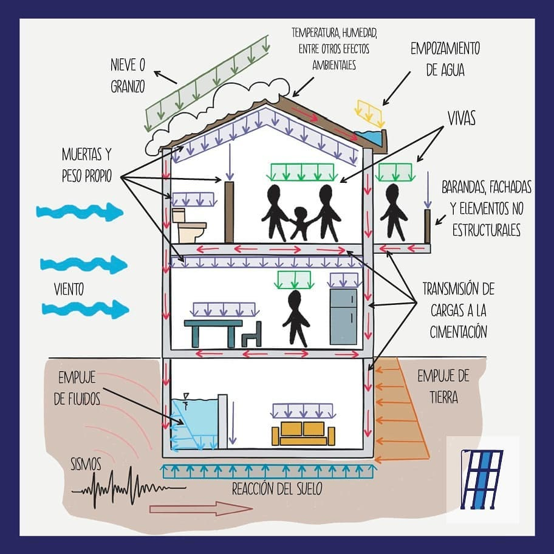

# **2. FUERZAS Y CARGAS**

## ¿Qué es una **fuerza**?

{align=right width=40%}

¿Has intentado alguna vez abrir una puerta muy pesada o empujar una caja? ¿O has sentido cómo el viento te empuja mientras caminas? En ambos casos estás experimentando algo fundamental en la física: **las fuerzas**. Las fuerzas están presentes en cada momento de nuestras vidas, desde que nos levantamos por la mañana hasta que nos acostamos por la noche: cuando sujetas un libro, cuando la gravedad tira de ti al suelo, o cuando el viento mueve las ramas de un árbol.

## Fuerzas que nos rodean constantemente

Desde el momento en que despiertas, estás rodeado de fuerzas invisibles que actúan constantemente:

**🌍 La gravedad**: Es quien origina el peso de los objetos y hace que caigan al suelo. Sin ella, estaríamos flotando como los astronautas en el espacio.

**🌬️ El viento**: Empuja objetos y estructuras. Puede ser tan suave como una brisa o tan poderoso como un huracán que mueve edificios enteros.

**💪 La fuerza muscular**: Cada vez que empujas, tiras o saltas, generas fuerzas con tu cuerpo. Es la fuerza que utilizas para escribir, correr o levantar objetos.

**🚗 Las fuerzas mecánicas**: Mueven las máquinas, desde el motor de un coche hasta las aspas de un ventilador.

**⚡ Las fuerzas magnéticas**: Como la que atrae un imán hacia el hierro o la que hace funcionar los motores eléctricos.

### Definición técnica

!!! Definición de FUERZA

    Una **fuerza** es toda acción capaz de **deformar un cuerpo** (efecto estático) o de **cambiar su estado de movimiento o de reposo** (efecto dinámico).

## ¿Qué pueden provocar las fuerzas?

Las fuerzas causan **efectos** de dos tipos:

-   __Movimiento__ :material-bike-fast:{ .lg .middle }

    ---

    Cambian la **velocidad o la dirección** de un objeto. Por ejemplo:

    * Cuando lanzas una pelota, la fuerza de tu mano le da velocidad.
    * Cuando frenas en bicicleta, la fuerza de los frenos reduce tu velocidad.
    * Cuando el viento cambia la dirección de una cometa.

-   __Deformación__ :material-racquetball:{ .lg .middle }

    ---
    Modifican la **forma** de un objeto temporal o permanentemente:

    - Al apretar una esponja, cambias su forma temporalmente.
    - Cuando doblas un clip, puede quedar deformado permanentemente.
    - Al estirar un chicle, cambia su forma hasta romperse.

## ¿Qué es una **carga**?

Las **cargas** son las fuerzas que actúan específicamente sobre las **estructuras artificiales** (como puentes, edificios o torres). Cada vez que alguien entra en un edificio o sopla el viento contra una fachada, está aplicando una carga sobre la estructura.

{align=middle width=80%}

### Tipos de cargas

-   **Cargas fijas (estáticas)**: :material-wall:{ .lg .middle }

    ---
    Son aquellas que siempre están presentes y no varían, como el peso propio de la estructura (paredes, vigas, tejados).

    Ejemplos:

    - El peso de las columnas de un edificio
    - El peso de las vigas del techo
    - El peso de las paredes de ladrillo

-   **Cargas variables (dinámicas)**: :material-weather-windy:{ .lg .middle }

    ---
    Cambian con el tiempo o pueden desaparecer. Por ejemplo:

    - El peso de las personas o muebles dentro del edificio
    - El viento que sopla sobre un puente
    - La nieve o el agua sobre el tejado
    - Los vehículos que pasan por un puente

