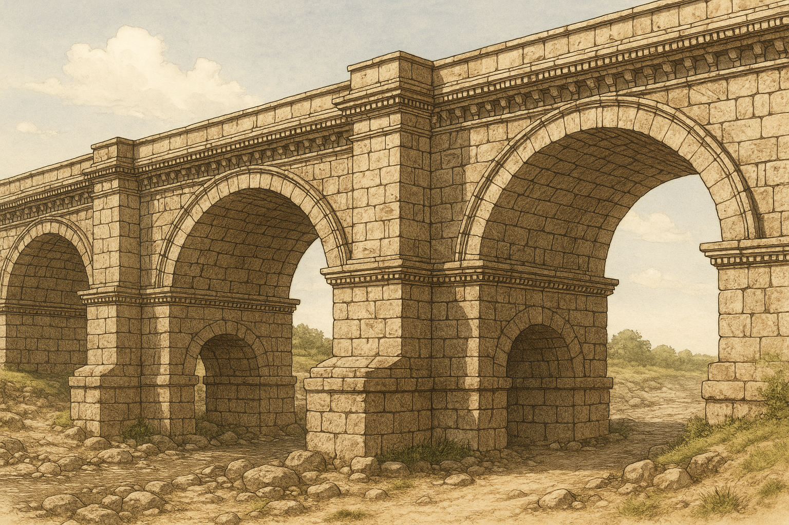

# **4. TIPOS DE ESTRUCTURAS ARTIFICIALES**

Hay muchos tipos de estructuras. Una forma sencilla de clasificarlas es por su forma o los elementos que predominan en ellas. Siguiendo este criterio, podemos encontrarnos con estructuras **masivas, entramadas, abovedadas, trianguladas y colgantes**.

## **1. Estructuras Masivas**

{align=right width=40%}

> **¿Qué son?** Estructuras en las que predomina una gran concentración de material.

- **Características:** Macizas, estables y muy pesadas; dejan poco espacio libre en su interior
- **Materiales:** Granito, mármol o hormigón (resistentes a compresión)
- **Ejemplos:** Pirámides egipcias y mayas, templos griegos, presas de embalses, murallas y diques

## **2. Estructuras Abovedadas**

{align=right width=40%}

> **¿Qué son?** Predominan los arcos, bóvedas o cúpulas como elementos de sujeción y soporte.

- **Elementos clave:**
    - **Arco:** Parte de estructura en forma de curva
    - **Bóveda:** Sucesión de varios arcos
    - **Cúpula:** Bóveda con forma semiesférica
- **Ventaja:** Soportan fuertes esfuerzos de compresión y cubren grandes espacios
- **Refuerzo:** Necesitan **contrafuertes** para reforzar los muros laterales
- **Ejemplos:** Teatros, circos y acueductos romanos, iglesias, catedrales, mezquitas, túneles

## **3. Estructuras Entramadas**

{align=right width=40%}

> **¿Qué son?** Formadas por perfiles de madera, acero u hormigón que se entrecruzan entre sí.

- **Elementos estructurales:** Vigas, pilares (o columnas) y cimentación
- **Ventaja:** Disminución de peso respecto a estructuras masivas, permitiendo mayor altura
- **Tipos de cimentación:**
    - **Zapatas:** Para terreno firme
    - **Losas y pilotes:** Para terreno blando
- **Ejemplos:** Edificios modernos (se cubren con ladrillos o cristal después de colocar la estructura)

!!! example "**EXPERIMENTA**"
    1. Coge palillos o pajitas y colócalos sueltos
    2. Después aplica fuerza con la mano
    3. Haz un entramado cruzado y repite la operación

    **¿Cuál es más resistente?** El entramado cruzado es mucho más resistente.
    
## **4. Estructuras Trianguladas**

{align=right width=40%}

> **¿Qué son?** Se forman con la unión de muchos triángulos, construyendo redes planas o espaciales.

- **Principio:** Cada triángulo soporta esfuerzos de **tracción** o **compresión**, equilibrándose la estructura
- **Ventaja:** Pueden crecer todo lo que se desee manteniendo resistencia y ligereza
- **Materiales y nombres:**
    - **Madera:** Se llaman **cuchillos**
    - **Acero:** Se llaman **cerchas**
- **Características:** Muy resistentes y ligeras (están huecas)
- **Ejemplos:** Torres de alta tensión, grúas, plataformas petrolíferas, estadios deportivos, algunos puentes

## **5. Estructuras Colgantes**

{align=right width=40%}

> **¿Qué son?** Sustentadas por cables o perfiles sujetos a elementos de soporte.

- **Elemento predominante:** **Tirantes** (sometidos a esfuerzos de tracción)
- **Componentes de puentes colgantes:**
    - **Tablero:** Metálico para paso de vehículos
    - **Pilares:** De hormigón con cimientos muy profundos
    - **Tirantes:** Sujetan el tablero y se amarran desde las orillas
- **Ventaja:** Permiten puentes más largos con menos pilares intermedios
- **Aplicación:** Especialmente útil para atravesar ríos anchos, bahías, etc.
- **Característica:** Si los cables se rompieran, el puente se hundiría

## **Resumen comparativo**

| Tipo | Material principal | Esfuerzo principal | Características | Ejemplos |
| :-- | :-- | :-- | :-- | :-- |
| **Masiva** | Piedra, hormigón | Compresión | Pesada, estable, poco espacio interior | Pirámides, presas |
| **Abovedada** | Piedra, ladrillo | Compresión | Cubren grandes espacios | Catedrales, túneles |
| **Entramada** | Acero, madera, hormigón | Flexión/compresión | Ligera, permite altura | Edificios modernos |
| **Triangulada** | Acero, madera | Tracción/compresión | Muy resistente y ligera | Torres eléctricas, grúas |
| **Colgante** | Cables de acero | Tracción | Salva grandes distancias | Puentes colgantes |

## **¿Por qué es importante conocer estos tipos?**

Entender los diferentes tipos de estructuras artificiales te ayuda a:

- **Reconocer** el tipo de estructura que ves en tu entorno
- **Comprender** por qué se eligió esa forma para esa función específica
- **Apreciar** la ingeniería detrás de cada construcción
- **Aplicar** estos conocimientos en tus propios diseños y proyectos

**¡Observa tu entorno y trata de identificar qué tipo de estructura es cada edificio, puente o torre que encuentres!**

⁂
