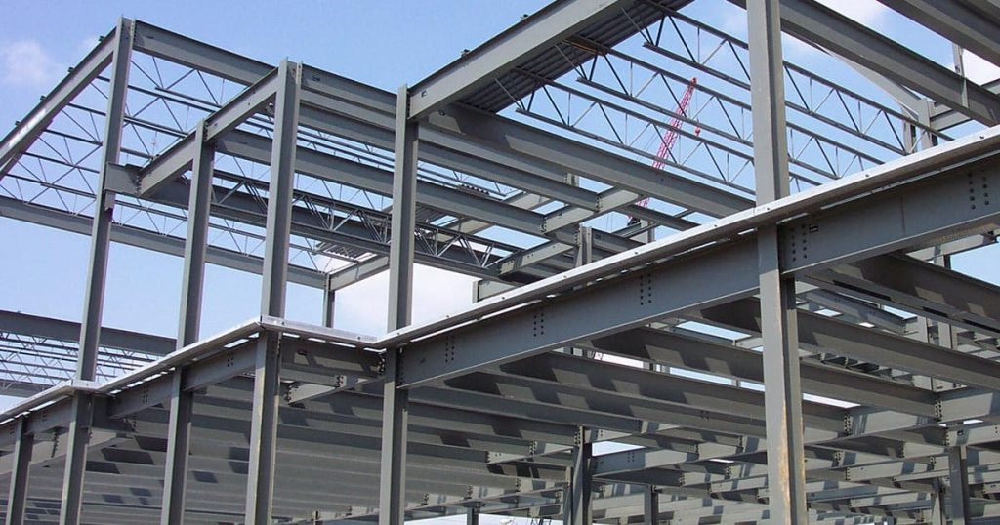
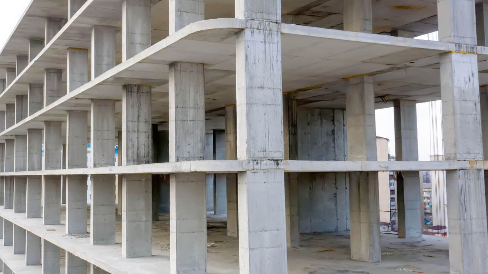
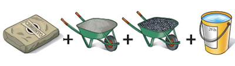
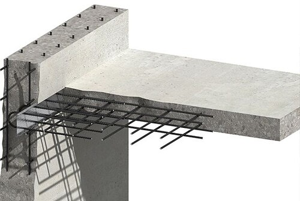

# **5. MATERIALES Y ESTRUCTURAS**

## **Materiales tradicionales en la construcción**

A lo largo de la historia, los seres humanos han utilizado diversos materiales para construir estructuras, desde los más básicos hasta los más sofisticados:

- **Piedra**: Granito, mármol, caliza
- **Madera**: Roble, pino, cedro
- **Barro y arcilla**: Adobe, ladrillo cocido
- **Metal**: Hierro, bronce, acero
- **Materiales modernos**: Hormigón, plásticos, materiales compuestos

## **Materiales principales para construir estructuras: el acero y el hormigón**

Hay muchos materiales que nos sirven para construir estructuras, desde el plástico para los objetos pequeños, hasta el acero y el hormigón para los grandes edificios.

A continuación estudiaremos con algo más de detalle estos dos últimos materiales, que debido a su gran resistencia, se utilizan mayoritariamente en las estructuras que deben soportar cargas pesadas.

### **El Acero**

La mayoría de los metales que usamos son **aleaciones**, mezclas de metales entre sí o con otras sustancias. Por ejemplo, el acero es una aleación en la que el componente principal es el hierro.

{align=right width=50%}

#### **Características del acero:**

- **Composición**: Aleación de hierro con carbono
- **Resistencia**: Muy alta tanto a tracción como a compresión
- **Versatilidad**: Se puede moldear en vigas y perfiles de muchos tipos
- **Durabilidad**: Material inoxidable (a diferencia del hierro puro)

#### **Aplicaciones del acero:**

- Construcción de edificios, puentes, torres y barcos
- Fabricación de cubiertos y objetos en contacto con agua
- Perfiles estructurales (vigas en I, columnas, cerchas)
- Refuerzo del hormigón (hormigón armado)

### **El Hormigón**

El hormigón es uno de los materiales más importantes en la construcción de edificios, puentes, torres, presas y otras grandes obras.

{align=right width=50%}

#### **Composición del hormigón:**

{align=right width=50%}

- **Cemento**: Aglutinante que une todos los componentes
- **Arena**: Agregado fino que rellena espacios
- **Grava**: Piedras pequeñas que dan resistencia
- **Agua**: Activa la reacción química del cemento

#### **Características del hormigón:**

- **Resistencia a compresión**: Excelente
- **Resistencia a tracción**: **Limitada** (punto débil del material)
- **Moldeabilidad**: Se puede dar cualquier forma mientras está fresco
- **Durabilidad**: Muy larga vida útil

### **El Hormigón Armado: La solución perfecta**

Para superar la limitación del hormigón en tracción, se desarrolló el **hormigón armado**:

> **¿Qué es?** Hormigón al que se han añadido largas varillas de acero antes de que endurezca.

{align=right width=50%}

#### **Ventajas del hormigón armado:**

- **El hormigón** soporta muy bien la **compresión**
- **El acero** soporta muy bien la **tracción**
- **Juntos** forman un material completo y resistente
- Se utiliza especialmente para hacer **pilares** que ganan resistencia

#### **Funcionamiento:**

1. Se colocan las varillas de acero en el molde
2. Se vierte el hormigón líquido alrededor del acero
3. Al fraguar, ambos materiales trabajan unidos
4. El resultado es una estructura híbrida muy resistente

## **Comparación de materiales estructurales**

| Material | Resistencia a compresión | Resistencia a tracción | Peso | Coste | Aplicaciones principales |
| :-- | :-- | :-- | :-- | :-- | :-- |
| **Hormigón** | ⭐⭐⭐⭐⭐ | ⭐⭐ | Alto | Bajo | Cimientos, pilares, presas |
| **Acero** | ⭐⭐⭐⭐ | ⭐⭐⭐⭐⭐ | Medio | Alto | Vigas, estructuras trianguladas |
| **Hormigón armado** | ⭐⭐⭐⭐⭐ | ⭐⭐⭐⭐ | Alto | Medio | Edificios, puentes, túneles |
| **Madera** | ⭐⭐⭐ | ⭐⭐⭐ | Bajo | Medio | Casas, estructuras ligeras |
| **Piedra** | ⭐⭐⭐⭐⭐ | ⭐⭐ | Muy alto | Variable | Estructuras masivas históricas |

## **¿Por qué es importante conocer los materiales?**

Entender las propiedades de los materiales te ayuda a:

- **Elegir** el material adecuado para cada aplicación
- **Comprender** por qué las estructuras se construyen de determinada manera
- **Apreciar** la evolución de la construcción a lo largo de la historia
- **Diseñar** estructuras más eficientes y seguras

## **Curiosidades sobre materiales estructurales**

!!! info "¿Sabías que...?"
- El hormigón romano (hace 2000 años) era tan bueno que muchas estructuras siguen en pie
- La Torre Eiffel pesa 6.300 toneladas pero si fuera de piedra pesaría más de 200.000 toneladas
- El acero puede reciclarse infinitas veces sin perder sus propiedades
- El hormigón es el segundo material más consumido en el mundo después del agua

**¡La elección correcta del material es fundamental para que una estructura sea resistente, duradera y económica!**

⁂
