# **6. ESFUERZOS**

La acción de las fuerzas sobre los cuerpos y su estructura provoca efectos internos en ellos.

!!! example "EXPERIMENTA"

    {align=right width=30%}   

    1. Cógete los dedos índices y tira de ellos.

    2. Junta las palmas de las manos y apriétalas.

        a. ¿Qué sientes?

        b. ¿Tienes la misma sensación en ambos casos?
    
    Notas una tensión que aumenta según crece la fuerza que ejerces, ¿verdad? Además, el tipo de tensión es diferente en cada caso. Como consecuencia de aplicar unas fuerzas sobre nuestro cuerpo aparecen otras "internas" que tratan de contrarrestar el efecto de las primeras.

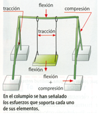{align=right width=30%}

Los seres vivos notamos este efecto, que puede ir de lo apenas perceptible a lo doloroso. Los objetos no sienten dolor, pero las fuerzas provocan en ellos un efecto similar que les produce deformaciones. En ambos casos, esta tensión interna se denomina esfuerzo.

Las estructuras deben resistir diferentes tipos de fuerzas que intentan deformarlas o romperlas. Cuando una estructura soporta una fuerza, **en su interior** se generan unas tensiones llamadas **esfuerzos**. Según cómo actúan las fuerzas y cómo reacciona el material, existen varios tipos de esfuerzos importantes en tecnología y construcción.

!!! Definición

    Esfuerzo es la **fuerza interna** que aparece en un cuerpo al aplicarle fuerzas desde el exterior.

* La función de las estructuras es soportar estos esfuerzos para no romperse ni deformarse demasiado.

* La forma y material de cada elemento estructural determinan a qué tipo de esfuerzo resiste mejor.

Estos esfuerzos varían con la intensidad de la fuerza y su dirección y con la forma del objeto que la soporta. Podemos clasificar los esfuerzos según la dirección y el sentido en que actúan las fuerzas que los originan.

## **1. Tracción**

!!! info "¿Qué es?"
    {align=right width=30%}
    Esfuerzo producido cuando las fuerzas tratan de **estirar** un cuerpo en direcciones opuestas.

 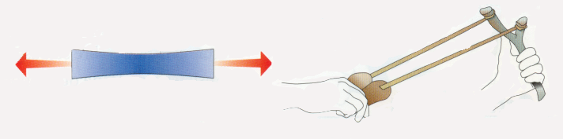{width=100%}

* **Fuerzas:**
Dos fuerzas opuestas, actuando hacia el exterior y en sentidos contrarios.
* **Efecto:**
El cuerpo tiende a **alargarse**, aumentando su longitud.
* **Ejemplos:**
    * Los **tirantes** de un puente colgante (estructura).
    * La **cuerda** de una tienda de campaña tensada.
    * Los **tendones** en el cuerpo al impulsar la pierna para saltar.
    * El **cable** de un ascensor cuando sube una cabina.

  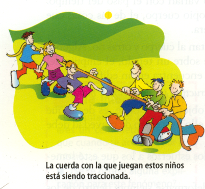{width=40%}  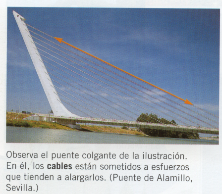{width=40%}

## **2. Compresión**

!!! info "¿Qué es?"

    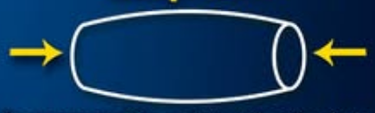{align=right width=30%}  
    Esfuerzo que aparece cuando las fuerzas tratan de **aplastar o comprimir** un cuerpo.

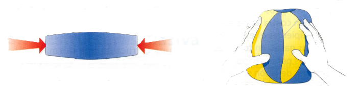{width=90%}

* **Fuerzas:**
Dos fuerzas opuestas, actuando hacia el interior y en sentidos contrarios.
* **Efecto:**
El cuerpo tiende a **acortarse**, disminuyendo su longitud.
* **Ejemplos:**
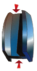{align=right width=10%}
    * Un **pilar** soportando el techo de un edificio (estructura).
    * Un **ladrillo** en la base de una pared.
    * La **pierna** al aterrizar de un salto.
    * Una **columna** en un templo griego o una presa.

## **3. Flexión**

!!! info "¿Qué es?"
    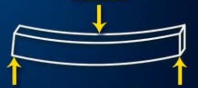{align=right width=30%}
    Esfuerzo al intentar **doblar o curvar** un elemento mediante fuerzas aplicadas en diferentes posiciones.

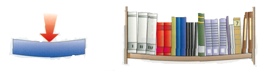

* **Fuerzas:**
Varias fuerzas: unas empujan, otras tiran. Actúan en diferentes puntos de la pieza.
* **Efecto:**
El cuerpo se **curva**: una zona se estira (tracción) y otra se aplasta (compresión).
* **Ejemplos:**
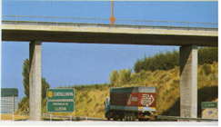{align=right width=30%}
    * Una **viga** que sostiene el suelo entre dos paredes (estructura).
    * Un **estante** cargado de libros.
    * Una **rama** cuando un niño se cuelga de ella.
    * El **tablero** de un puente al pasar un camión pesado (estructura).

## **4. Torsión**

!!! info "¿Qué es?"
    {align=right width=30%}
    Esfuerzo que se da cuando intentan **retorcer** el elemento aplicando fuerzas opuestas en cada extremo.

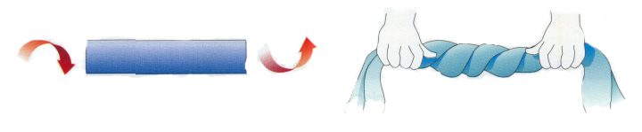

* **Fuerzas:**
Dos fuerzas giratorias, cada una en sentido contrario, aplicadas en los extremos.
* **Efecto:**
El cuerpo **gira en espiral**, como un tornillo o cuerda al torcerse.
* **Ejemplos:**
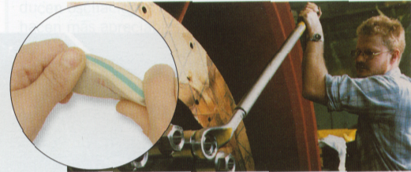{align=right width=30%}
    * El **eje** de una grúa giratoria al levantar cargas (estructura).
    * Escurrir una **toalla** retorciéndola.
    * Una **barra de plastilina** que se retuerce.
    * La **llave** al abrir una puerta.

## **5. Cizalladura o cortadura**

!!! info "¿Qué es?"
    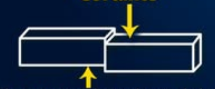{align=right width=30%}
    Esfuerzo al aplicar **dos fuerzas muy próximas en sentidos opuestos** para intentar cortar el objeto.

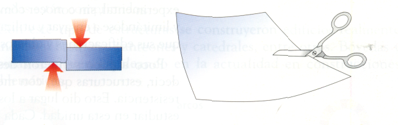

* **Fuerzas:**
Dos fuerzas paralelas y muy cercanas, una hacia arriba y otra hacia abajo.
* **Efecto:**
El cuerpo se **separa o corta** en dos partes en el plano de acción de las fuerzas.
* **Ejemplos:**
 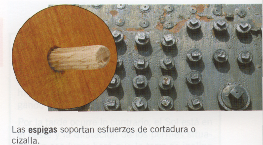{align=right width=30%}
    * Un **remache** que une dos chapas metálicas y soporta que se deslicen entre sí (estructura).
       * Las **tijeras** cortando papel.
    * Un **alambre** al ser cortado por unos alicates.
    * El **tallo de una flor** cortado con la mano.

⁂
