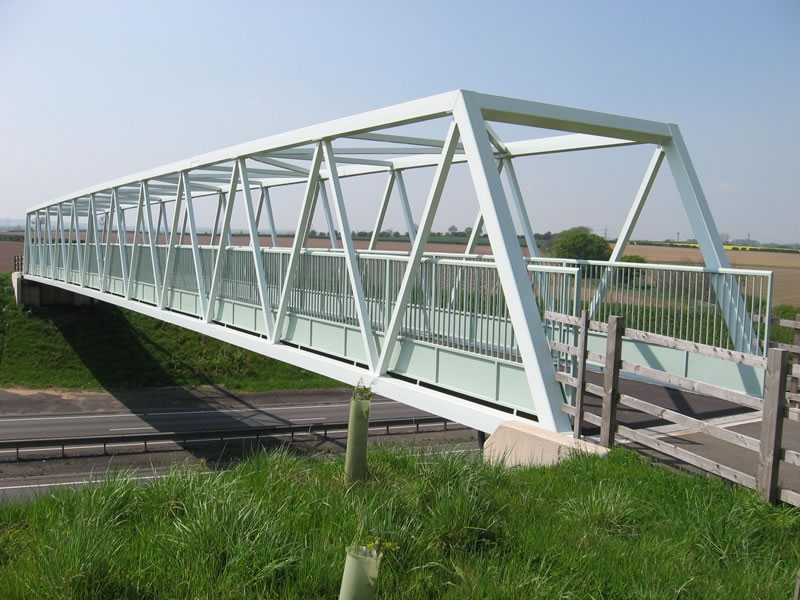

# ELEMENTOS DE UNA ESTRUCTURA

Para que una estructura funcione correctamente, es decir, sea **resistente, rígida y estable**, necesita estar formada por una serie de **elementos estructurales** bien diseñados y distribuidos. Estos elementos no están colocados al azar: cada uno **cumple una función** muy concreta y **resiste determinados tipos de esfuerzos** cuando sobre la estructura actúan distintas fuerzas o cargas.

## **Vigas:** repartiendo las cargas

{align=right width=50%}

Las **vigas** son los elementos **horizontales** que conectan los pilares entre sí o con otros muros de carga. 

Su papel es muy importante porque ayudan a **repartir los pesos hacia los pilares o apoyos** y evitan que sufra solo una parte de la estructura.

A menudo, las vigas están hechas de hormigón armado o acero, y se colocan justo bajo los suelos, los techos o sobre los marcos de las puertas y ventanas. 

Al ejercer su función, las vigas sufren sobre todo **flexión**, es decir, tienden a curvarse bajo el peso de la carga.

{width=40%}

## **Pilares o columnas:** los "ascensores" de las cargas

{align=right width=50%}

La vigas descansan sobre las **columnas** o **pilares**, que se colocan de forma **vertical**. 

Su trabajo principal es **recibir las cargas** (suelos, techos, tejados, otra plantas…) de las vigas  y **transferir esa carga hasta los cimientos**.

Si observas cualquier edificio, verás columnas de hormigón, acero o madera; incluso las patas de una mesa cumplen esta función en miniatura. 

Las columnas trabajan principalmente a **compresión**, aguantando grandes pesos sin deformarse.

{width=40%}

## **Cimientos:** la base de todo

{align=right width=50%}

En cualquier edificio, puente o torre, el elemento fundamental es el **cimiento**. 

Los cimientos se sitúan bajo tierra y tienen la misión de transmitir y repartir todo el peso de la construcción al terreno, evitando que la estructura se hunda o se incline.

Imagina unos zapatos muy anchos repartiendo tu peso sobre el barro: cuanta más superficie, menos te hundes.

Así funcionan los cimientos, que suelen estar hechos de hormigón armado, un material especialmente resistente.

{width=40%}

## **Arcos:** curvar para resistir

{align=right width=50%}

En muchas construcciones antiguas y modernas encuentras **arcos**, que son elementos curvos capaces de soportar grandes pesos desviando la fuerza hacia sus apoyos laterales. 

Los arcos fueron una de las grandes aportaciones de la arquitectura romana, y todavía hoy se usan en puentes, entradas monumentales y bóvedas.

Trabajan, principalmente, a **compresión**, ya que cada pieza (*dovela*) del arco “empuja” contra la siguiente, manteniendo el conjunto estable sin necesidad de pegamento.

{width=80%}

## **Tirantes:** aguantando la estructura

{align=right width=25%}

A veces la resistencia y la estabilidad se consiguen con elementos que “tiran”, en vez de empujar: son los **tirantes** o **tensores**. Se ven muy bien en puentes colgantes, cubiertas de estadios modernos o grandes torres eléctricas. 

Suele tratarse de cables de acero o barras metálicas. Los tensores están diseñados para soportar esfuerzos de **tracción**, es decir, para resistir ser estirados sin romperse. Actúan manteniendo tensa una parte de la estructura o evitando movimientos indeseados.

## **Barras formando triángulos:** dando rigidez a la estructura

{align=right width=40%}

La **triangulación** es una técnica de construcción muy importante que se usa para hacer estructuras más fuertes, seguras y, sobre todo, rígidas (poca deformación). Se basa en crear triángulos usando barras, llamadas **perfiles**..

Dependiendo dela colocación de los perfiles y las cargas soportadas, cada uno de las barras pueden estar sometidas a **tracción** o a **compresión**[^1]. 

[^1]: Recuerda cómo lo demostró el profesor en clase.

(Recuerda cómo lo demostró el profesor en clase)

!!! note "Importante"
    {align=right width=20%}
    El **triángulo** es el único polígono que no cambia de forma, aunque le empujemos o estiremos los lados.  
    Si sometemos a un cuadrado a una fuerza, se deforma y se vuelve un rombo.

    Por eso, muchas estructuras (puentes, torres, andamios…) tienen partes en forma de triángulo.

{align=right width=20%}

### ¿Qué ventajas tiene usar triángulos?

* Más resistencia y estabilidad: Las estructuras con triángulos no se doblan ni se caen fácilmente.

{align=right width=18%}

* Mejor reparto del peso: Los triángulos ayudan a que el peso se reparta bien, y las piezas no se rompan.

* Menos material: Se puede usar menos material y la estructura sigue siendo fuerte.

### Ejemplos de triangulación en la vida real

{align=right width=30%}

* Los puentes suelen tener barras formando triángulos.

* Las torres metálicas (como la Torre Eiffel) están hechas con muchos triángulos pequeños.

* Los marcos de bicicletas, andamios y hasta las estanterías fuertes usan triángulos.

## Otros elementos importantes

- **Riostras**: Son barras que se colocan en diagonal, sobre todo en estructuras entramadas o trianguladas, para aumentar la rigidez y evitar que la estructura se deforme.
- **Muros de carga**: Grandes paredes que, además de separar espacios, ayudan a soportar el peso de techos y plantas superiores, muy típicos en casas antiguas.
- **Perfiles**: Son barras metálicas de diferentes formas (en L, U, H, etc.) que refuerzan columnas y vigas para hacerlas más resistentes sin aumentar demasiado el peso.

## ¿Cómo trabajan juntos estos elementos?

En toda estructura resistente, **todos estos elementos colaboran**:

- Los cimientos transmiten el peso al suelo.
- Las columnas y pilares llevan el peso de arriba hasta la base.
- Las vigas reparten los esfuerzos y conectan los apoyos.
- Los arcos salvan los huecos grandes usando la compresión.
- Los tirantes y riostras dan estabilidad frente a vientos, movimientos o vibraciones.

Juntos, hacen posible que la estructura resista fuerzas muy intensas sin romperse ni deformarse.

## Actividad de observación

Mira a tu alrededor, en casa o en tu centro:

- ¿Dónde ves columnas? ¿Para qué sirven allí?
- ¿Puedes distinguir alguna viga? ¿Cómo está colocada?
- ¿Has notado algún arco en puertas, ventanas o entradas?
- ¿Ves cables o tirantes en algún puente o cubierta?

Detectar estos elementos en el entorno te ayudará a entender cómo se diseñan las estructuras que usamos cada día.

## Conceptos clave

- **Elemento estructural**: Parte de una estructura diseñada para resistir un esfuerzo.
- **Cimiento**: Base que reparte el peso al suelo.
- **Columna/Pilar**: Soporte vertical resistente a compresión.
- **Viga**: Elemento horizontal que resiste flexión.
- **Arco**: Elemento curvo que trabaja a compresión.
- **Tirante**: Elemento que resiste tracción, asegura la estabilidad.

¿Quieres que añada imágenes concretas de cada tipo de elemento o que sugiera alguna práctica para que el alumnado los dibuje en un croquis de su propia casa o instituto?

⁂
