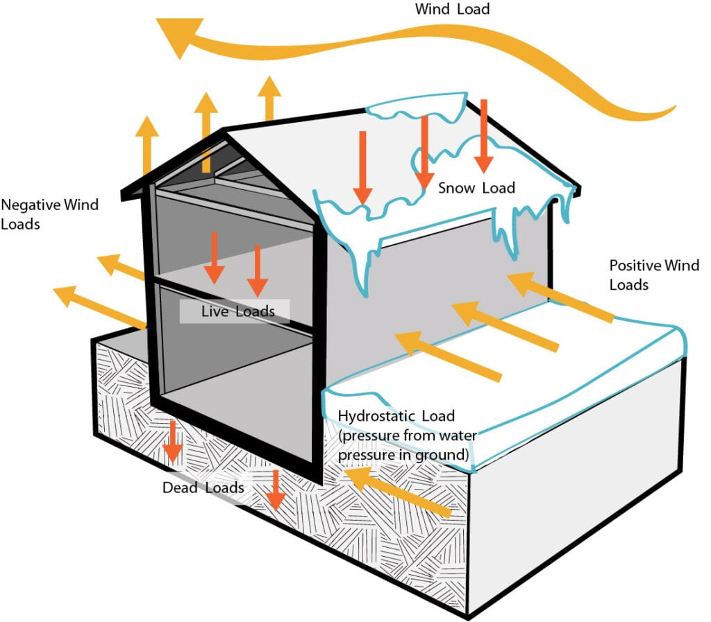
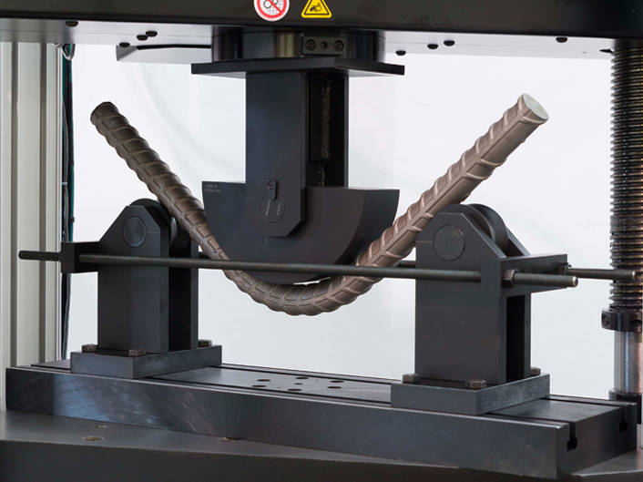
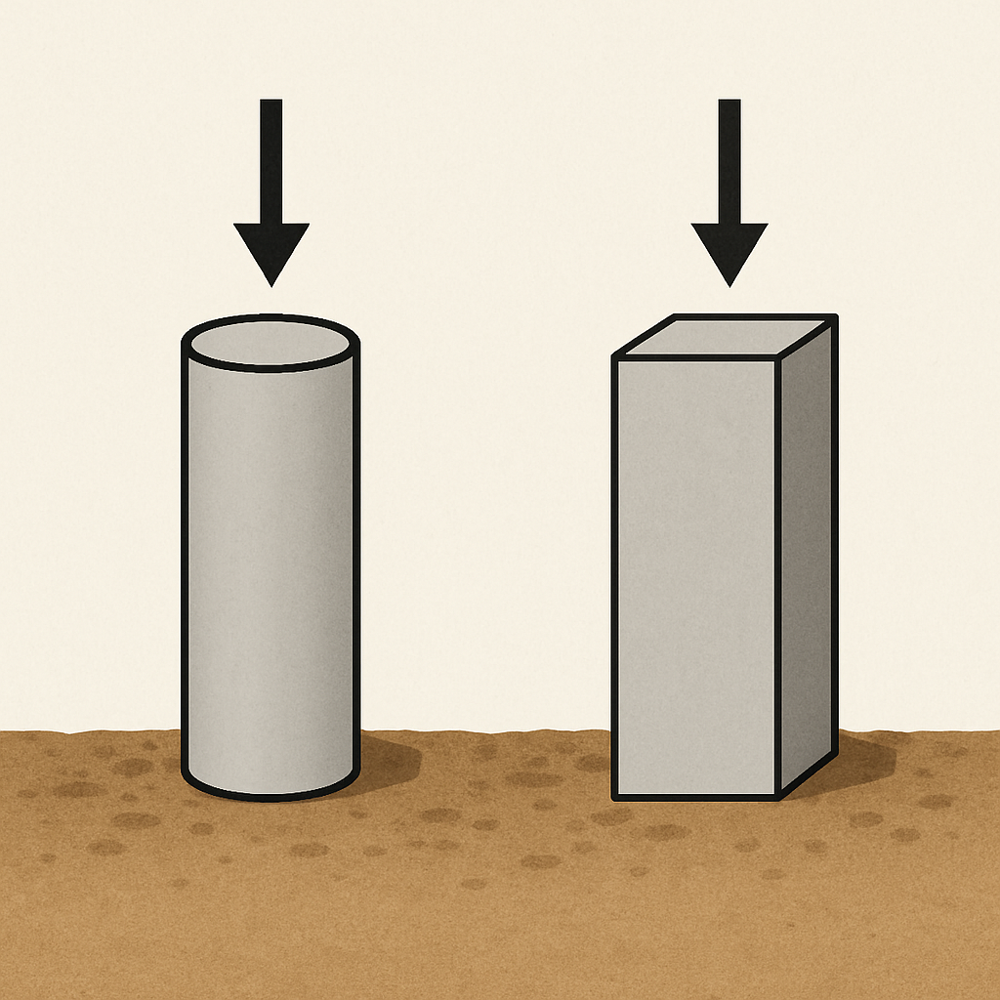
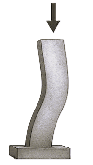
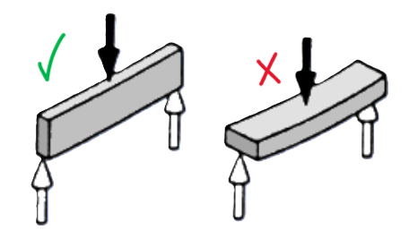
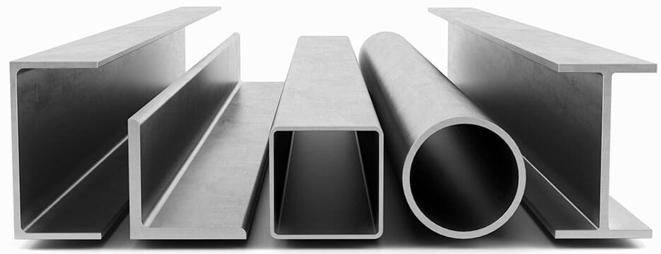
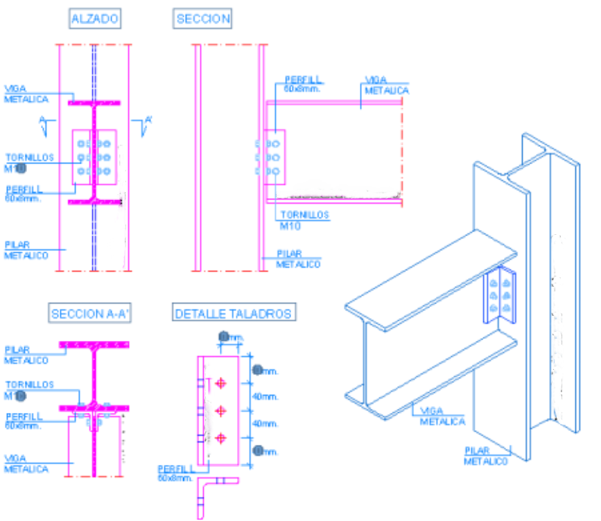

# LA RESISTENCIA EN LAS ESTRUCTURAS

La **resistencia** es una de las cualidades más fundamentales que debe tener cualquier estructura. **Sin resistencia, una estructura no puede cumplir su función: se deformaría, rompería o caería ante las fuerzas y cargas que actúan sobre ella**.

## ¿Qué significa resistencia en una estructura?

{align="right" width="40%"}

!!! note "Resistencia"        
    Significa que la estructura es capaz de **soportar fuerzas o cargas manteniendo su forma**, sin romperse ni sufrir deformaciones permanentes.

-   Una estructura **resistente** conserva su integridad y seguridad aunque le apliquemos fuerzas, como el peso propio, personas, muebles, viento, nieve, terremotos…
-   Sin suficiente resistencia, puede haber **colapsos** o fallos peligrosos.

## ¿Cómo se consigue que una estructura sea resistente?

Si conocemos de antemano el tipo de esfuerzo (tracción, compresión, flexión...) al que está sometido un elemento estructural, podemos hacerlo resistente de **dos maneras principales**:

{align="right" width="30%"}

### **1. Seleccionando el material adecuado** al esfuerzo soportado

Es fácil comprobar que los distintos materiales **no resisten de la misma manera** los diferentes tipos de esfuerzos. Así como el acero resiste muy bien todos los tipos de esfuerzos, el hormigón solo resiste la compresión. Veamos algunos materiales:

| MATERIAL | ESFUERZOS que soporta mejor | EJEMPLOS de uso | Notas |
|----------------|--------------------|----------------|--------------------|
| **Madera** | Tracción, compresión, flexión, torsión y cortadura | Vigas, pilares, estructuras triangulares (cerchas) | Las cargas no pueden ser excesivas |
| **Acero** | Tracción, compresión, flexión, torsión y cortadura | Vigas, pilares, cables, cerchas | Muy resistente |
| **Hormigón** | Compresión | Pilares, muros, cimientos, arcos | Solo se puede utilizar en elementos a compresión |
| **Hormigón armado** | Compresión y algo los demás esfuerzos | Pilares, vigas, losas, plataforma de puentes | Gracias al acero soporta más esfuerzos |
| **Materiales pétreos** (granito, mármol,...) | Compresión | Muros, arcos, bóvedas, cimientos | Muy resistente a compresión, casi nada a tracción |

-   **Ejemplo práctico:** Para un cable de un puente colgante (esfuerzo de tracción), elegimos acero. Para una columna (esfuerzo de compresión), eliges hormigón o piedra.

### **2. Eligiendo la forma adecuada para cada elemento** según el esfuerzo soportado

Empecemos estudiando qué forma geométricas son las mejores para soportar los esfuerzos de compresión y de flexión.

-   **Compresión**:

{align="right" width="30%"}

El hormigón es muy resistente a la compresión (aplastamiento), así que se usa para soportar cargas verticales grandes. Pero, si le damos la forma de columna recta, con sección **cilíndrica** o **prismática** (cuadrada o rectangular), soportará todavía mejor los esfuerzos de compresión.

Estas formas reparten el peso de manera uniforme y evitan deformaciones.

Se usan en pilares, postes, soportes de puentes y edificios, aprovechando al máximo la resistencia del material.

⚠️ Pero atención: el **pandeo**

{align="right" width="10%"}

Cuanto más larga es una columna, más fácil es que pueda doblarse o “pandear” cuando la comprimimos mucho, incluso aunque el material sea resistente. Esto ocurre porque las **columnas largas**, aunque sean gruesas, **pueden doblarse** como una regla larga si presionamos los extremos.

-   **Flexión**:

{align="right" width="30%"}

Las **vigas** en los edificios, puentes y otras estructuras suelen estar sometidas a **flexión**, que es la fuerza que trata de doblarlas cuando tienen peso encima (como personas, objetos o el propio techo).

La **altura o canto** de la viga (la distancia de arriba a abajo) es clave: cuanto **más alta** es la viga, **más difícil es doblarla**. Así puede soportar mayor peso sin curvarse o romperse.

#### **Perfiles de acero**

{align="right" width="30%"}

Los **perfiles** de acero son barras alargadas que tienen diferentes formas (sección transversal) porque cada una está diseñada para aguantar mejor **ciertos tipos de esfuerzos** según su función en una estructura.

Cada uno de ellos suele llamarse por el nombre de la letra a la que se parece: perfil en H, I, L...

## Perfiles de acero: Tipos y usos según esfuerzos

| Tipo de perfil | Esfuerzo más soportado | Características principales |
|-----------------|---------------------------|----------------------------|
| Perfil **H** | Compresión | Pilares y columnas (cargas pesadas ) |
| Perfil **I** | Flexión | Vigas que soportan doblamiento |
| Perfil **U** (canal) | Flexión | Soportes de tejados que llevan menos peso |
| Perfil **L** (ángulo) | Tracción y compresión | Perfiles o barras de estructuras trianguladas |
| Perfil hueco | Compresión y torsión | Columnas y postes resistentes y estables |
| Perfil tubular redondo | Torsión y flexión | Ejes de máquinas |

{width="50%"}

## **En resumen**

-   **Resistencia estructural:** Es la capacidad de soportar cargas sin romperse ni deformarse demasiado.
-   **Se consigue combinando:**

1.  Un **material óptimo** según el tipo de esfuerzo principal (tracción, compresión, flexión, etc.).
2.  Una **forma inteligente** adaptada a ese esfuerzo (columna, viga, arco, triángulo…).

**¡Un diseño resistente es la mejor garantía de seguridad!**

⁂
