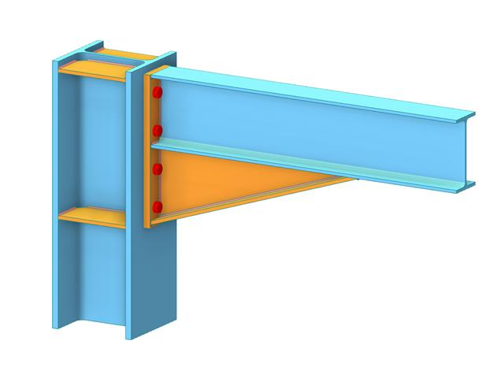
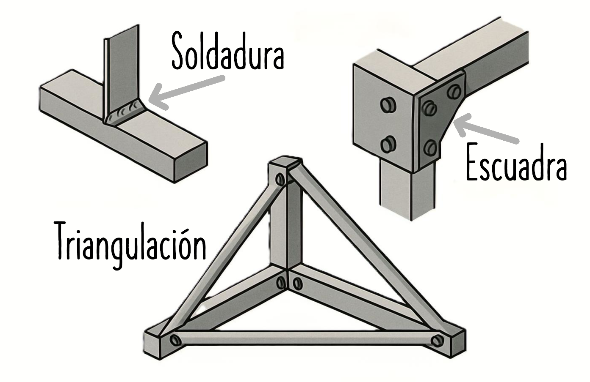

# **9. LA RIGIDEZ EN LAS ESTRUCTURAS**

La **rigidez** es una de las cualidades esenciales que debe cumplir una estructura para funcionar correctamente, junto con la **resistencia** y la **estabilidad**.

## ¿Qué significa rigidez?

!!! note "Rigidez"
    Significa que la estructura **no se deforma (o solo lo hace dentro de unos límites muy pequeños)** al recibir las cargas o fuerzas para las que fue diseñada.

- Una estructura rígida mantiene su forma y geometría durante su uso.
- Aunque **siempre hay pequeñas deformaciones**, éstas no deben impedir que la estructura cumpla su función.
- Una estructura puede ser muy resistente, pero si no es rígida, se puede deformar tanto que resulte inútil o peligrosa.

**Ejemplo:**  
Un puente demasiado flexible podría oscilar o combarse al pasar vehículos, aunque no llegue a romperse.

## ¿Por qué es importante la rigidez?

- Evita deformaciones que comprometan el uso, la seguridad o la comodidad (como movimientos excesivos en puentes o edificios altos con viento).
- Aumenta la durabilidad de la estructura, evitando que las piezas cedan prematuramente.
- Mejora el comportamiento estructural ante esfuerzos propios y externos.

## ¿Cómo se consigue la rigidez?

{align=right width=40%}

Para que una estructura sea rígida **no es suficiente con elegir buenos materiales**...

>  ...hay que prestar especial atención a las **uniones** de los elementos estructurales.

Las uniones son puntos clave porque:

- Si son **débiles o flexibles**, la estructura perderá rigidez aunque sus elementos sean muy robustos.
- Una **mala unión** puede permitir giros o desplazamientos que debilitan toda la estructura.

### Métodos para conseguir uniones rígidas

#### 1. **Soldadura**
- Se funde el material de las piezas (normalmente metal) para unirlas formando un todo continuo.
- Proporciona una **conexión fija y muy resistente**.
- Usada en estructuras de acero como puentes, torres o vigas metálicas.

{align=right width=40%}

#### 2. **Escuadras o piezas de refuerzo**
- Son piezas, normalmente metálicas, en forma angular o de cartela, que se colocan en esquinas, uniones y empalmes.
- **Evitan giros** en las uniones y reparten las cargas.
- Muy frecuentes en estructuras de madera, acero o aluminio.

#### 3. **Triangulación**
- Disposición de barras o perfiles formando **triángulos** en la estructura.
- El triángulo es el polígono más indeformable, por lo que mantiene la geometría en uniones y marcos.
- Utilizada en torres eléctricas, grúas, puentes metálicos y cubiertas.

---

## Diferencia entre resistencia y rigidez

| Propiedad     | Qué significa | Ejemplo |
|---------------|--------------|---------|
| **Resistencia** | Capacidad de **no romperse** aunque actúen fuerzas | Un cristal puede resistir mucho peso colocado uniformemente |
| **Rigidez**    | Capacidad de **no deformarse** en exceso | Una viga de acero muy alta apenas se curva con la carga |

---

## Resumen

- La **rigidez** es tan importante como la resistencia: evita deformaciones que puedan impedir el uso de una estructura.
- Se logra **reforzando las uniones** con soldaduras, escuadras y triangulación.
- Una **unión débil** hace que toda la estructura pierda rigidez, por muy buenos que sean los materiales.
```

<div style="text-align: center">⁂</div>