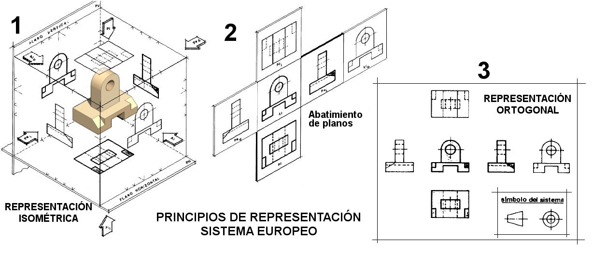

La pregunta que te lancé era cómo representar un objeto de tres dimensiones en una hoja de papel, que solo tiene dos. Es un gran reto, y la solución es uno de los conceptos más importantes del dibujo técnico.

¡Vamos a redactar el siguiente capítulo!

***

### **Capítulo 4: Las Vistas de un Objeto (Sistema Diédrico)**

Como ya sabemos, los objetos reales tienen volumen (alto, ancho y profundo), pero el papel es plano. Para solucionar esto, el dibujo técnico utiliza un método llamado **Sistema Diédrico**, que consiste en representar el objeto como si lo miráramos desde diferentes posiciones. Cada una de estas imágenes se llama **vista**.

Las vistas son las proyecciones de las caras de un objeto sobre diferentes planos (como si fueran paredes imaginarias). Aunque un objeto tiene seis caras, para definirlo por completo normalmente nos bastan tres vistas principales:

*   **Alzado:** Es la vista más importante, la que nos da más información del objeto. Es la imagen que vemos al mirar el objeto **de frente**.
*   **Planta:** Es la imagen que vemos al mirar el objeto **desde arriba**.
*   **Perfil:** Es la imagen que vemos al mirar el objeto **desde un lado**. Puede ser el perfil izquierdo (mirando desde la izquierda) o el derecho (mirando desde la derecha).

#### **4.1. La Colocación de las Vistas**

Para que todo el mundo pueda interpretar el plano de la misma manera, la posición de las vistas sigue una regla internacional (en Europa usamos el Sistema Europeo). La colocación es siempre la misma:

1.  Se dibujan unos ejes que dividen el papel en cuadrantes.
2.  El **Alzado** se dibuja en el cuadrante superior izquierdo.
3.  La **Planta** se dibuja justo **debajo** del alzado.
4.  El **Perfil Izquierdo** se dibuja justo a la **derecha** del alzado.

#### **4.2. La Correspondencia entre Vistas**

Lo más importante es que las vistas deben estar relacionadas entre sí, ya que son partes del mismo objeto. Esto se llama **correspondencia entre vistas**.

*   El **Alzado** y la **Planta** tienen la misma **anchura**.
*   El **Alzado** y el **Perfil** tienen la misma **altura**.

Esto significa que deben estar perfectamente alineadas. Para asegurarnos, se suelen usar líneas auxiliares finas que conectan unas vistas con otras.

#### **4.3. Las Seis Vistas de un Objeto**

Aunque el alzado, la planta y el perfil izquierdo son las tres vistas más importantes, un objeto tiene en realidad seis caras. Por tanto, podemos obtener hasta seis vistas diferentes, que se nombran de la siguiente manera:

*  **Alzados**:
   *   **Alzado anterior** o vista de frente.
   *   **Alzado posterior** o vista desde atrás.
*   **Plantas**:   
    *   **Planta superior** o vista desde arriba.
    *   **Planta inferior** o vista desde abajo.
*   **Perfiles**:
    *   **Perfil izquierdo** o vista desde la izquierda (de la persona que mira el objeto).
    *   **Perfil derecho** o vista desde la derecha (de la persona que mira el objeto).

Sin embargo, casi nunca es necesario dibujar las seis vistas. La razón es que, con las tres vistas principales (alzado, planta y perfil izquierdo), la mayoría de los objetos ya quedan perfectamente definidos y se entiende su forma y medidas sin ninguna duda.

¡Muy buena pregunta! La colocación de las vistas no es al azar, sigue unas reglas muy estrictas para que cualquier persona en Europa pueda entender el plano de la misma manera. Este método se conoce como **Sistema Europeo**.

Aquí te redacto cómo se organiza, para que lo incluyas en los apuntes.

***

#### **4.4. La Colocación de las Vistas (Sistema Europeo)**

{align=right width=40%}

Para que todos los dibujos técnicos se puedan interpretar de la misma forma, la posición de las vistas sigue una norma internacional (UNE 1032 en España). Es como si metiéramos el objeto en una caja de cristal y luego desplegáramos sus caras.

En el Sistema Europeo de representación, el observador está por delante de la pieza y, detrás de la pieza estará el plano de proyección.

**Observador – Pieza – Plano de proyección**

El observador proyecta la vista de la pieza, hasta el plano de proyección, obteniendo la vista proyectada.

Debajo se pueden ver las vistas desde la representación isométrica a la representación ortogonal en el Sistema Europeo.

{ align=left }

La colocación es siempre la siguiente:

1.  **El Alzado (vista de frente) es la vista principal** y se toma como referencia. Se coloca en el centro del área de dibujo.
2.  **La Planta (vista desde arriba)** se dibuja siempre **debajo** del alzado.
3.  **El Perfil Izquierdo (lo que vemos desde la izquierda)** se dibuja a la **derecha** del alzado.

Aplicando esta misma lógica de "desplegar la caja", las otras tres vistas se colocarían así:

*   **La Planta Inferior (vista desde abajo)** se dibujaría **encima** del alzado.
*   **El Perfil Derecho (lo que vemos desde la derecha)** se dibujaría a la **izquierda** del alzado.
*   **La Vista Posterior (lo que vemos desde atrás)** se dibujaría a la derecha del perfil izquierdo.

Normalmente, con las tres vistas principales (alzado, planta y perfil izquierdo) es suficiente para definir un objeto.

***

Entendido. Entonces, para que quede claro, si estás dibujando el alzado de un coche y quieres añadir la vista desde el lado del conductor (el izquierdo), ¿en qué posición la dibujarías con respecto al alzado?

***

Ahora que conocemos los nombres de las seis vistas, ¿cómo crees que se colocarían en el papel?

Si el alzado es la vista central, ¿dónde crees que se dibujaría la vista desde abajo (planta inferior) o la vista desde la derecha (perfil derecho)?

***

Ahora que sabemos cómo dibujar la forma de un objeto desde sus tres vistas principales, ¿qué información fundamental crees que nos falta para que alguien pueda fabricarlo con las medidas exactas?